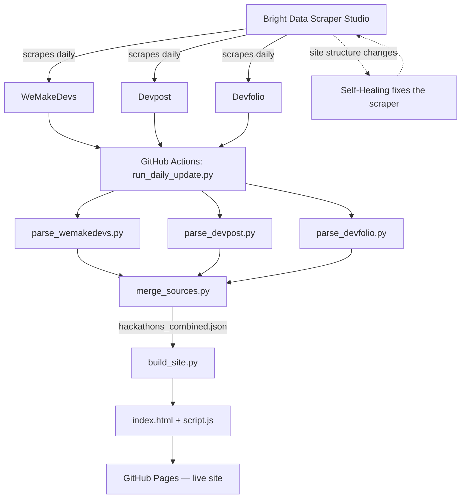

# 🏁 HackFinder

**A live, filterable feed of hackathons — scraped, self-healing, and auto-refreshed daily.**

Built solo for **WeMakeDevs × Bright Data's "Into the Scrape-Verse"** hackathon (Aug 17–23, 2026).

🎥 **Demo video:** https://youtu.be/uXntM0YgwTY?si=rLARtrksTbrcAGJN

---

## Why I built this

Every hackathon season I end up with 6 browser tabs open — WeMakeDevs, Devpost, Devfolio — trying to figure out what's actually still open, what's beginner-friendly, and what's already ended. So instead of doing that manually every week, I built a scraper that does it for me and just shows me a clean list of what I can actually join *right now*.

No rankings, no "best hackathon for you" claims — just facts, pulled straight from the source, with a link back so you can always verify for yourself.

---

## What it does

- Scrapes **three sources** — WeMakeDevs, Devpost, and Devfolio — using Bright Data's **Scraper Studio**
- Automatically figures out if a hackathon is **open**, **running right now**, or **already closed** (closed ones get dropped — no point showing something you can't join anymore)
- Normalizes messy, inconsistent data from three completely different websites into one clean format
- Filters by **status** (open/running) and **mode** (remote/in-person/hybrid)
- Refreshes itself **once a day, automatically** — no manual re-scraping required
- Self-heals when a source site changes its layout, using Bright Data's built-in Self-Healing

---

## How it works

**In plain words:** Bright Data scrapes all three sites once a day → a small Python pipeline cleans, deduplicates, and figures out each hackathon's real status by checking the actual dates (not just trusting whatever the site says) → everything gets merged into one file → that file builds the actual webpage → GitHub Pages serves it. If a site changes its layout mid-way, Bright Data's Self-Healing catches it and fixes the scraper without me touching anything.

---

## The pipeline, file by file

| File | What it does |
|---|---|
| `run_daily_update.py` | Triggers all Bright Data collectors via API and downloads fresh results |
| `parse_wemakedevs.py` / `parse_devpost.py` / `parse_devfolio.py` | Cleans each source's raw scrape, computes real status (open/running/closed) from actual dates |
| `hackathon_dates.py` | Shared date-parsing logic — one place to fix date formats instead of three |
| `merge_sources.py` | Combines all three sources into one deduplicated, sorted dataset |
| `build_site.py` | Injects the final data into the page templates |
| `index_template.html` / `script_template.js` / `styles.css` | The actual site design |
| `.github/workflows/` | The GitHub Action that runs this whole pipeline once a day |

I split this into small single-purpose scripts on purpose — it means if one source breaks (which happened more than once while building this), I can fix just that one file without touching anything else.

---

## A few honest limitations

- This isn't real-time — it refreshes once a day via the automated pipeline, not on every page visit.
- A couple of WeMakeDevs entries don't have descriptions since that particular re-scrape pulled from an older archive page instead of the live listing — the site shows a graceful fallback message for those instead of leaving a blank card.
- Status detection relies on parsing each site's date text, which varies a lot between sources. I built a fairly solid parser for it, but an unusual date format could occasionally slip through.

---

## Credits

Built by **Shourya** for WeMakeDevs × Bright Data's Scrape-Verse hackathon.

This project leaned heavily on AI tools during a very compressed one-week build, and I want to be upfront about that:

- **Claude (Anthropic)** — helped architect the scraping pipeline, debug several tricky bugs (a stale date bug, a broken status parser, a mismatched API response shape in the automation script), write the parsers, and generally pair-program through this whole thing.
- **OpenAI Codex** — used for quick code generation and boilerplate along the way.
- **Bright Data Scraper Studio** — does the actual scraping and self-healing this project is built around.

I wrote the ideas, made every product decision, and understand every part of what's here — but I'm crediting the tools that helped me build it faster, since that's only fair.

---

## License

MIT — see [LICENSE](./LICENSE).
